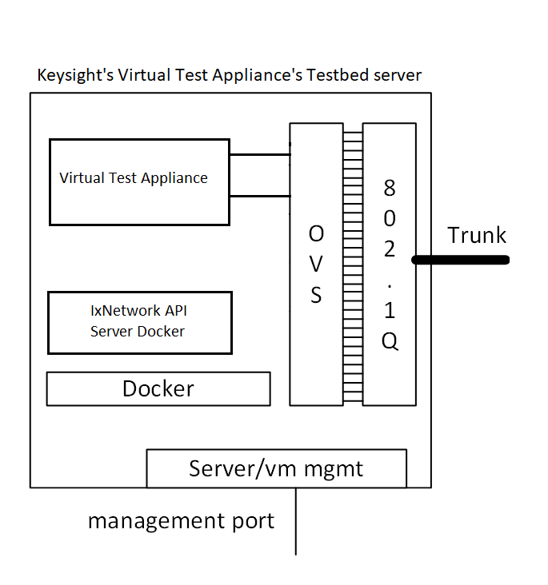

# Testbed Setup with Keysight Virtual Appliances and IxNetwork API Server container t11

This document describes the steps to setup a testbed with Virtual Test Appliance (in short VTM) and IxNetwork API Server container.

The test components like veos, ceos and ptf are not used here.

For **TL;DR** refer [here](#tldr).

## Testbed server
The schematic diagram below provides an overview of the setup.


### Network connections
- The testbed server has 2 network ports:
  - Trunk port to root fanout switch.
  - Server management port to manage the server, VTMs and IxNetwork Api Server container running on the server.
- The management bridge here referred to as `br1` is connected to the server management port.

### Virtual Test Appliance module - VTM
- There are 3 network interfaces -
    - 1 management interface to be connected to the `br1`.
    - 2 test interfaces to be connected to open-vswitch bridges. (viz. `br-<vm_name>-<index>`)

## Prepare testbed server

- Install Ubuntu 18.04 amd64 on the server.
- Setup internal management network bridge `br1`. A sample `netplan` configuration is as below.
    ```
    network:
      ethernets:
        ens192:
          dhcp4: false
      version: 2
      bridges:
        br1:
          interfaces: [ens192]
          dhcp4: true
    ```
- Python version should be atleast `2.7.17`.
- Install docker as below. The docker here is needed to run the sonic-mgmt container.
    ```shell
    $ wget -O get-docker.sh https://get.docker.com/

    $ sudo ./get-docker.sh
    ```
- Clone the sonic-mgmt repo into your working directory-
    ```shell
    $ git clone https://github.com/Azure/sonic-mgmt
    ```

## Run the sonic-mgmt container with VTM specification
- Download pre-built *sonic-mgmt* image from [here](https://sonic-jenkins.westus2.cloudapp.azure.com/job/bldenv/job/docker-sonic-mgmt/lastSuccessfulBuild/artifact/sonic-buildimage/target/docker-sonic-mgmt.gz).
    ```shell
    $ wget https://sonic-jenkins.westus2.cloudapp.azure.com/job/bldenv/job/docker-sonic-mgmt/lastSuccessfulBuild/artifact/sonic-buildimage/target/docker-sonic-mgmt.gz
    ```
- Load *sonic-mgmt* image
    ```shell
    $ docker load -i docker-sonic-mgmt.gz
    ```
- Download VTM and IxNetwork API Server container images from the following links -
    - [Virtual Test Appliance (VTM)](https://support.ixiacom.com/support-overview/product-support/downloads-updates/ixvm). The *qcow2* image for *KVM* needs to be downloaded.
    - [IxNetwork API Server](https://ks-aws-prd-itshared-opix.s3-us-west-1.amazonaws.com/IxSoftwareUpgrades/IxNetwork/9.0_Update3/Ixia_IxNetworkWeb_Docker_9.00.100.213.tar.bz2).

    Downloaded files would be like below respectively-
    - `Ixia_Virtual_Test_Appliance_9.10_KVM.qcow2.tar.bz2`
    - `Ixia_IxNetworkWeb_Docker_9.10.2007.146.tar.bz2`

- Place the downloaded files in a folder say `~/keysight_images`. This location needs to be mounted on `/images` inside the *sonic-mgmt* container.
    > **Note** If you load the *IxNetwork API Server* docker image in your docker registry then you need not to place `Ixia_IxNetworkWeb_Docker_9.10.2007.146.tar.bz2` inside the `~/keysight_images` folder. In that case you need to consider the `docker_registry_host` in `ansible/vars/docker_registry.yml` file. If local file is used it will not pull from the docker registry.

- Run the `setup-container.sh` in the root directory of the sonic-mgmt repository:
    ```shell
    $ cd sonic-mgmt
    $ ./setup-container.sh -n <container name> -d /data -v <path to the keysight images folder>
    ```
    > e.g. `./setup-container.sh -n sonicmgmt -d /data -v ~/keysight_images`

    From now on, all steps are running inside the *sonic-mgmt* docker **unless otherwise specified**.

    You can enter your sonic-mgmt container with the following command:

    ```shell
    $ docker exec -u <alias> -it <container name> bash
    ```

- Setup public key to login into the linux host from sonic-mgmt docker. You may use `ssk-keygen` and `ssh-copy-id` for the same.
- Create dummy `password.txt` under `/data/sonic-mgmt/ansible`

  Please note: Here "password.txt" is the Ansible Vault password file name/path. Ansible allows user to use Ansible Vault to encrypt password files. By default, this shell script requires a password file. If you are not using Ansible Vault, just create a file with a dummy password and pass the filename to the command line. The file name and location is created and maintained by user.
- Say the user name of the host server is `foo`.
- On the host, run `sudo visudo` and add the following line at the end:
    ```
    foo ALL=(ALL) NOPASSWD:ALL
    ```

## Modify configuration files
- Modify credentials in `ansible/group_vars/vm_host/creds.yml` accordingly.
- In `ansible/group_vars/vm_host/main.yml` add/modify the below lines
    ```
    vtm_image_name: Ixia_Virtual_Test_Appliance_9.10_KVM.qcow2
    ixnetwork_api_server_docker_image_file: Ixia_IxNetworkWeb_Docker_9.10.2007.146.tar
    ixnetwork_api_server_docker_image_name: ixnetworkweb_9.10.2007.146_image
    ```

- **Modify configuration file for the testbed server** -

    Modify veos/*your configuration file* to use the username in `ansible_user`, e.g., `foo` to login to linux host (this can be your username on the host). Edit IP addresses and `host_var_file` as per need.

    Example snippet below - (Refer to the `sonic-mgmt/ansible/veos` or `sonic-mgmt/ansible/veos_vtb` files.)
    ```
    server_1:
        vars:
            host_var_file: host_vars/STR-ACS-VSERV-01.yml
        children:
            vm_host_1:
            vms_1:

    # Entry for IxNetwork API Server
    vm_host_1:
        hosts:
            STR-ACS-VSERV-01:
                ansible_host: 10.250.0.101
                ansible_user: foo

    # Entry for Virtual Test Appliance - VTM
    vms_1:
        hosts:
            VM0120:
                ansible_host: 10.250.0.102
    ```
    > Note: VTM entries should have a prefix 'VM' in their name.

## Setup Virtual Test Appliances (VTM) in the server
To start VTM –
```shell
$ ./testbed-cli.sh -m keysight_testbed_config -n 1 -k keysight_vtm start-vms server_1 password.txt
```
Here `-k` option specifies to deploy `keysight_vtm`.

Please note: Here "password.txt" is the Ansible Vault password file name/path. Ansible allows user to use Ansible Vault to encrypt password files. By default, this shell script requires a password file. If you are not using Ansible Vault, just create a file with a dummy password and pass the filename to the command line. The file name and location is created and maintained by user.


## Setup IxNetwork API Server
- Edit the testbed-csv file to add entry like below-
    ```csv
    # conf-name,group-name,topo,ptf_image_name,ptf,ptf_ip,ptf_ipv6,server,vm_base,dut,comment
    example-ixia,vms6-1,t0_keysight,docker-keysight-api-server,example-ixia-ptf-1,10.39.32.194/22,,server_1,VM0120,[vlab-01],Test with Keysight API Server
    ```

    > Note: `ptf_imagename` should be `docker-keysight-api-server`.

- For topology configuration refer to the `topo_t0_keysight.yml` file. The `vtm_port_index` field is used to specify respective VTM test interface.

- To start IxNetwork API Server
    ```shell
    $ ./testbed-cli.sh -t vtestbed.csv -m keysight_testbed_config add-topo example-ixia password.txt
    ```

## Stop IxNetwork API Server
```shell
$ ./testbed-cli.sh -t vtestbed.csv -m keysight_testbed_config remove-topo example-ixia password.txt
```

## Stop Virtual Test Appliances (VTM)
```shell
$ ./testbed-cli.sh -m keysight_testbed_config -n 1 -k keysight_vtm stop-vms server_1 password.txt
```

## TL;DR
- Download [Virtual Test Appliance (VTM) qcow2 image](https://support.ixiacom.com/support-overview/product-support/downloads-updates/ixvm) and [IxNetwork API Server](https://ks-aws-prd-itshared-opix.s3-us-west-1.amazonaws.com/IxSoftwareUpgrades/IxNetwork/9.0_Update3/Ixia_IxNetworkWeb_Docker_9.00.100.213.tar.bz2). Place the files in `~/keysight_images`.
- Create management bridge.
- Clone https://github.com/Azure/sonic-mgmt
- Download and run [sonic-mgmt]((https://sonic-jenkins.westus2.cloudapp.azure.com/job/bldenv/job/docker-sonic-mgmt/lastSuccessfulBuild/artifact/sonic-buildimage/target/docker-sonic-mgmt.gz)) docker using `./setup-container.sh -n sonicmgmt -d /data -v ~/keysight_images`
- Create dummy `password.txt` under `sonic-mgmt/ansible`. Modify `ansible/group_vars/vm_host/creds.yml` and the *testbed configuration file*.
- In `ansible/group_vars/vm_host/main.yml` add/modify the below lines
    ```
    vtm_image_name: Ixia_Virtual_Test_Appliance_9.10_KVM.qcow2
    ixnetwork_api_server_docker_image_file: Ixia_IxNetworkWeb_Docker_9.10.2007.146.tar
    ixnetwork_api_server_docker_image_name: ixnetworkweb_9.10.2007.146_image
    ```
- Edit the testbed-csv file to add entry like below-
    ```csv
    # conf-name,group-name,topo,ptf_image_name,ptf,ptf_ip,ptf_ipv6,server,vm_base,dut,comment
    example-ixia,vms6-1,t0_keysight,docker-keysight-api-server,example-ixia-ptf-1,10.39.32.194/22,,server_1,VM0120,[vlab-01],Test with Keysight API Server
    ```
- Start VTM - `./testbed-cli.sh -m keysight_testbed_config -n 1 -k keysight_vtm start-vms server_1 password.txt`
- Start IxNetwork API Server - `./testbed-cli.sh -t vtestbed.csv -m keysight_testbed_config add-topo example-ixia password.txt`
- To stop VTM - `./testbed-cli.sh -m keysight_testbed_config -n 1 -k keysight_vtm stop-vms server_1 password.txt`
- To Stop IxNetwork API Server - `./testbed-cli.sh -m keysight_testbed_config -n 1 -k keysight_vtm stop-vms server_1 password.txt`
